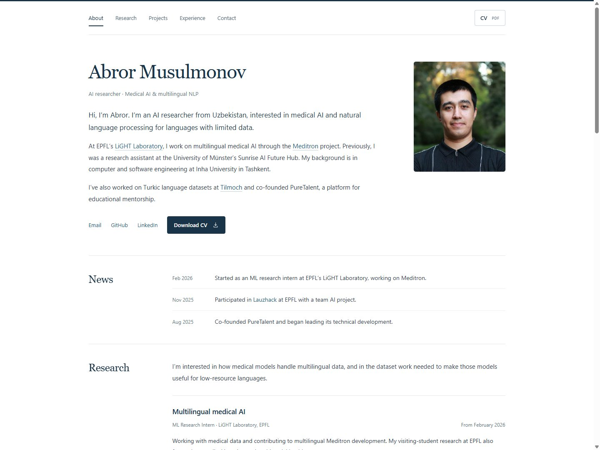

<div align="center">

# Abror Musulmonov

**Personal website · Medical AI · Multilingual NLP**

[Visit website](https://abrormusulmonov.github.io/) · [Download CV](https://abrormusulmonov.github.io/assets/Abror_Musulmonov_CV.pdf) · [LinkedIn](https://www.linkedin.com/in/abrormusulmonov/) · [Email](mailto:abrorjon.musulmonov@gmail.com)

</div>

[](https://abrormusulmonov.github.io/)

## About

The source for my personal academic website, covering research at EPFL's LiGHT Laboratory and the University of Münster, selected projects, education, professional experience, and community work.

The site uses **HTML, CSS, and a small amount of JavaScript**. There is no build step, package installation, framework, or external font dependency.

- Responsive layouts for phones, tablets, and desktop screens.
- A persistent navigation menu that highlights the section being read.
- Direct PDF downloads of the CV.
- Keyboard navigation, visible focus indicators, and a skip-to-content link.
- Print styles and readable content with JavaScript disabled.

## Run locally

Clone the repository, then start a static server with Python 3:

```sh
git clone https://github.com/AbrorMusulmonov/abrormusulmonov.github.io.git
cd abrormusulmonov.github.io
python -m http.server 8080 --bind 127.0.0.1
```

Open **http://127.0.0.1:8080**. You can also open `index.html` directly in a browser.

## Project structure

```text
.
├── index.html                 # Page content and metadata
├── styles.css                 # Layout, typography, mobile and print styles
├── script.js                  # Navigation highlighting and footer year
├── assets/
│   ├── abror.jpg              # Profile photograph
│   ├── favicon.svg            # Browser tab icon
│   └── Abror_Musulmonov_CV.pdf # Downloadable CV
├── docs/
│   └── preview.jpg            # README preview
├── robots.txt                 # Crawler instructions
├── sitemap.xml                # Canonical site URL
└── .nojekyll                   # Publish as plain static files
```

## Make updates

| What to change                                            | Where                                                            |
| --------------------------------------------------------- | ---------------------------------------------------------------- |
| Biography, research, projects, dates, and contact details | `index.html`                                                     |
| Colors, spacing, typography, and responsive layout        | `styles.css`                                                     |
| Navigation behavior                                       | `script.js`                                                      |
| CV                                                        | Replace `assets/Abror_Musulmonov_CV.pdf` using the same filename |
| Photograph or favicon                                     | Replace the corresponding file in `assets/`                      |
| README screenshot                                         | Replace `docs/preview.jpg`                                       |

The three CV links all point to the same PDF. Replacing that file updates every download link.

If you adapt the website to a different account or domain, also update the canonical and social metadata in `index.html`, the sitemap URL in `robots.txt`, and `sitemap.xml`.

## Publish

This public repository is the main source for **[abrormusulmonov.github.io](https://abrormusulmonov.github.io/)**.

GitHub Pages deploys the **`main` branch, repository root (`/`)**. Push a commit to `main` to publish an update. Deployment status is available in the repository's [Actions tab](https://github.com/AbrorMusulmonov/abrormusulmonov.github.io/actions).

Before publishing:

1. Preview at phone and desktop widths and check for horizontal overflow.
2. Follow the section links and check the active navigation indicator.
3. Download the CV and open the PDF.
4. Check edited links and the browser console.

---

Content is based on my CV. The profile photograph comes from my GitHub profile.
